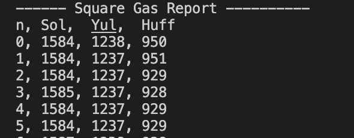
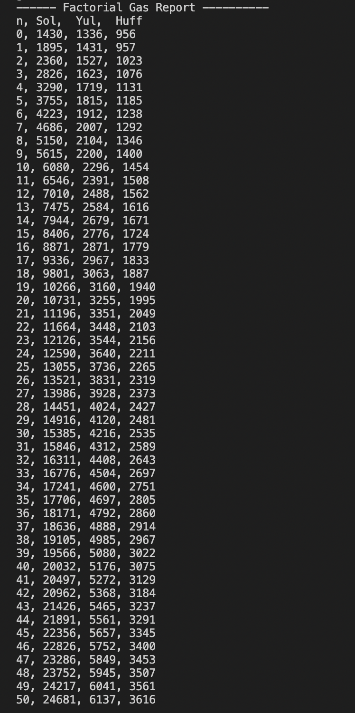

# Gas Optimizations / Gas Golfing using Huff , Yul
 - Huff being a low-level programming language, can be used to optimize Smart Contract (which results in less computation cost than Yul and Solidity).

 - Square using Huff
    - 

 - Factorial using Huff
   - `50!` using `Huff` consumes `15%` less gas than `Solidity`
   - 
